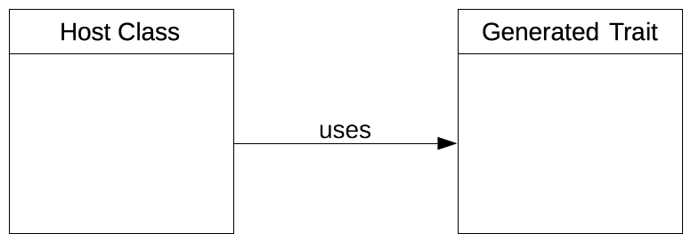

Best Practices
==============

The code generator was written with some thoughts in mind. See for yourself, if they are useful for you, too.

Template system for Code Bodies
-------------------------------

It is useful to use some kind of template system to load the contents for your bodies. The template system can also be used to replace variables in the templates.

Hack in Traits
--------------

Let's assume you generate a php class. This class will be used in your desired framework as it serves a specific purpose in there. It possible needs to fulfill an interface or some abstract methods and your generated code will also take care of this - wonderful. Now imagine the programmer wants to change the code your code generation tools created. Once you run the code generation tools again his changes probably got overwritten, which would be bad.

Here is the trick: First we declare the generated class as "host" class:

Your generated code will target the trait, where you can savely overwrite code. However, you must make sure the trait will be used from the host class and also generate the host class, if it doesn't exist. So here are the steps following this paradigm:

1. Create the trait
2. Check if the host class exists

   a. if it exists, load it
   b. if not, create it

3. Add the trait to the host class
4. Generate the host class code

That way, the host class will be user-land code and the developer can write his own code there. The code generation tools will keep that code intact, so it won't be destroyed when code generation tools run again. If you want to give the programmer more freedom offer him hook methods in the host class, that - if he wants to - can overwrite with his own logic.

Format in Post-Processing
-------------------------

After generating code is finished, it can happen that (especially) bodies are formatted ugly. Thus just run the suggested code formatter after generating the code. Can be found on github `gossi/php-code-formatter`_.

.. _gossi/php-code-formatter: https://github.com/gossi/php-code-formatter
